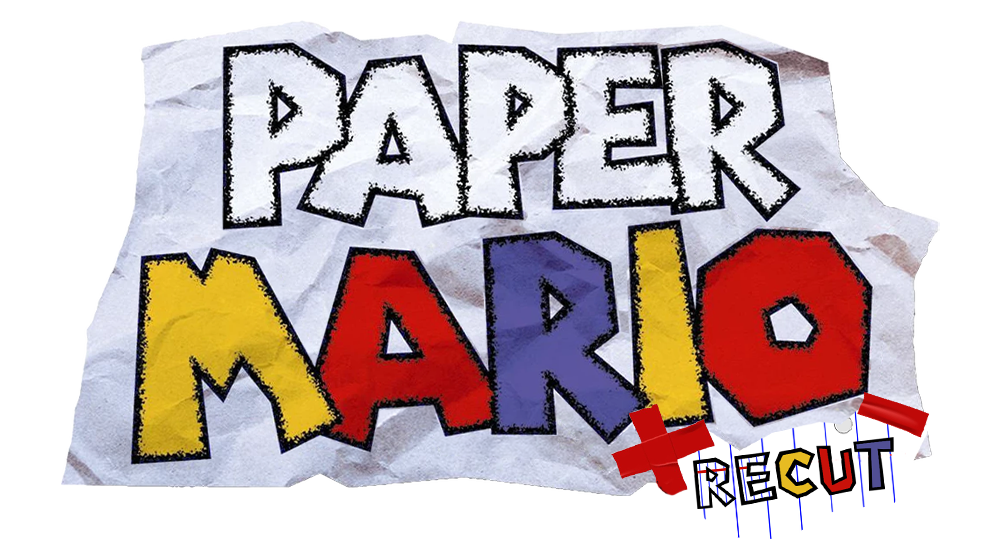

# Paper Mario ReCut


### 
Paper Mario ReCut is a native Windows PC recompilation project for *Paper Mario* on Nintendo 64. It is built around the N64 recompilation toolchain, RT64 rendering, local legal ROM setup, live texture replacement, and the bundled Paper Atlas Tool for editing dumped texture pieces.

This repository does not include ROM files, extracted ROM assets, save files, generated TOML, or generated recomp output. Release builds follow the Zelda64Recomp-style model: the app is already built, and the launcher asks for your legally dumped Paper Mario (U) ROM, validates it by hash, and stores it locally under that user's own `user` folder. Players do not need CMake, WSL, Git, compilers, or dependency downloads to launch the game.

## Clarification

There seems to be a lot of speculation about what this project is and how it came to be.

This started as a hobby project made for fun with the help of AI to get N64Recomp to work smoothly with the Paper Mario decomp. As many people who have tried generating the necessary files for N64Recomp know, the process can be tedious and, for many, not worth the time. I know a lot of people give up before getting very far. This project has existed for me a lot longer than the repo as well. I only created it when I had something to work with.

My workflow also uses AI integration for formatting and optimization as a final pass before changes are pushed to the GitHub repo. Unfortunately, even though it is supposed to avoid pushing anything in my workspace that could involve potentially illegal content, it treated the generated TOML file as safe to push. I glanced over it and missed the issue, which was not intentional. That has since been fixed.

This is just a fun project for me. I am not trying to claim that I was first, take credit from anyone else, or do anything that could hurt the scene. I apologize for anything that made it seem that way.

I have a lot of respect for HarbourMasters, and I would not mind or care if their version becomes the top-rated and most-played version while mine stays in the shadows. I do this for fun and preservation, which I believe is the real purpose behind projects like this.

I am new to this scene, and I am sorry for the mistakes I've made.

**False Stuffs:** 
This project was not fully “vibe coded” either.

Paper Atlas was created long before this project existed. I repurposed it for this project, which I have already explained.

I also do not know where the claim is coming from that the ROM check does not work. The project uses hash verification and the supplied ROM for N64Recomp. I have tried every way I can think of to recreate that claim, but I have not been able to reproduce it unless a clone was modified to behave that way. This was built in the exact manner the N64ZeldaRecomp is minus the cool fancy launcher so if there are issues in that way then there are other concerns.

N64Recomp uses the ROM provided to it during the static recompilation process. The ROM is supplied by the user, used by the tool, and then moved to the user folder after it has already been provided for later use by N64Recomp. Based on what I have tested, I suspect that some people making this claim may not have been testing in a clean-room setup.

The so called game assets included are not in any way from the ROM or assets therof. No assets from the ROM are included in the release PERIOD. They simply need to share their HASH references so they know where they need to replace said textures.

We need to stop giving so much weight to people who appear to have personal vendettas against AI and are trying to sabotage anything useful that may come from it. I chose to release this because Battleship has already proven to be an amazing port, and the possibilities these tools create for preservation are more important than people’s egos.

In the meantime I've been working on some of the stuff that doesn't work in the current release and I'm sure those who choose to play will be surprised and happy about what's been achieved. Update Soon!!

## Features

- PRESS F1 TO ACCESS THE MENU (Might change to ESC not sure yet lol)
- First-run legal ROM setup with local validation.
- Native launcher with Select ROM and Start Game flow.
- Windowed RT64 renderer integration.
- Graphics options menu with live-applying renderer settings.
- Live Texture Replacement toggle via F2.
- One-shot texture dumping with an in-window percentage and dump count.
- Continuous Dump mode for capturing newly created textures while the game keeps running.
- Paper Atlas Tool sidecar built for easy texture replacement and editing.
- Controller and keyboard configuration windows are present and still being expanded.

NOTE: The current Gamepad Implementaion will auto bind controls to known SDL controllers and the rebind system is currently in the works.

## Current Status

This is still an early working build. The game boots and the tooling is actively being shaped around Paper Mario as development continues.

Save states are implemented as an early runtime snapshot system. Slot saves and loads are queued onto Paper Mario's main game-loop boundary and store slots in `user/states/`. Treat them as testable while the runtime continues to mature. 

### Known issues:
1. Widescreen is currently broken, but it is still exposed for testing. Expect visual problems if you enable it. The normal 4:3 path is the intended play path for now.
2. Using Save States in it's current implementation will break the game. Avoid For Now.
3. Smartscreen is false positive until the app becomes signed. I have even submitted the exe for evaluation from microsoft with the response being just give it time for trust to be built. 
I apologize for any fear of the situation.


## Runtime Folders

Local runtime data lives under:

```text
user/
```

Important subfolders:

```text
user/pm.n64.us.z64
user/states/
user/textures/dumps/
user/textures/replacements/
user/AtlasEditing/
```

Do not commit or distribute ROMs, save files, generated ROM output, generated TOML, local dumps, local replacements, or `user` folders.

## Paper Atlas Tool


Paper Atlas Tool is included as a means for simple texture replacement and as it evolves will change the way Paper Mario will be experienced making texture modding very simple.
I originally was working on this tool for texture replacement for any N64 texture set but have repurposed it just for this and still has a lot of work to be done.

```text
tools/PaperAtlasTool/
```

Windows builds publish `PaperAtlasTool.exe` beside `PaperMarioReCut.exe`. You can open it from Graphics > Paper Atlas Tool or from the Texture Replacement window. If the expected dump or replacement folders are missing, the game and Atlas tool explain how to create them.

## Building

Release builds are already-built playable apps with a ROM launcher. Players only provide their legally dumped Paper Mario (U) ROM when the launcher asks for it.

Building from source follows the Zelda64Recomp-style workflow: clone the repo, provide your legal ROM locally, generate the ignored recomp output, then build with CMake.

Full instructions are in [BUILDING.md](BUILDING.md).

Short version:

```powershell
git submodule update --init --recursive
powershell -ExecutionPolicy Bypass -File scripts/generate_recomp_output.ps1 -RomPath "D:\path\to\Paper Mario (U).z64"
cmake -S . -B build-recut -G "Visual Studio 17 2022" -A x64 -DPAPER_MARIO_ROM_PATH="D:\path\to\Paper Mario (U).z64"
cmake --build build-recut --config Release --target PaperMarioReCut
```

Required build tools:

- Visual Studio 2022 with C++ desktop tools.
- CMake.
- Git.
- WSL2/Ubuntu for the local Paper Mario decompilation build.
- .NET 8 SDK for Paper Atlas Tool.

The generated folder `generated/paper_mario_recomp_out/` is local-only and intentionally ignored by Git. Do not commit generated recomp output, ROMs, saves, or `user/`.

The old setup-only bootstrap shell can still be built for local experiments, but it is not the release/player path:

```powershell
cmake -S . -B build-bootstrap -G "Visual Studio 17 2022" -A x64 -DPAPER_RECUT_BUILD_BOOTSTRAP=ON
cmake --build build-bootstrap --config Release --target PaperMarioReCut
```

## License And Credits

Paper Mario ReCut's original project code is released under the MIT License. See `LICENSE`.

This project also uses and credits third-party open-source work, especially:

- [N64Recomp](https://github.com/N64Recomp/N64Recomp) for the recompilation toolchain and runtime foundations.
- [RT64](https://github.com/rt64/rt64) for the renderer.
- [pmret/papermario](https://github.com/pmret/papermario) for the Paper Mario decompilation project, game-specific research, symbols, and source reference.
- [SDL2](https://github.com/libsdl-org/SDL) for windowing, input, controller, and audio support.

Third-party code remains under its own license terms. The upstream `pmret/papermario` repository does not currently publish a root license file, so Paper Mario ReCut does not relicense that work. See `THIRD_PARTY_NOTICES.md` and the license files inside `lib/`.

## Texture Replacement Instructions

1. Start Paper Mario ReCut and load the scene whose textures you want to edit.
2. Press F8, or open Graphics > Texture Replacement.
3. Hover Dump Textures for a reminder of what it does.
4. Press Dump Textures. Game input pauses briefly while the current scene's loaded textures are written as PNG v5 files to:

```text
user/textures/dumps/
```

5. The progress area shows a percentage plus how many textures are available as it dumps. Existing PNG v5 files are skipped, so repeat dumps only add newly seen textures.
6. For a broader capture, enable Continuous Dump. It keeps dumping textures as the game creates them and can slow the game down heavily depending on hardware, so turn it off when you are done.
7. Open Paper Atlas Tool from the Texture Replacement window or Graphics > Paper Atlas Tool.
8. Paper Atlas auto-selects the dump and replacement folders when launched beside the game exe.
9. Arrange pieces manually, use Auto Pack, Auto Edges, or Group Sizes.
10. Save Atlas + Layout. The combined work files are saved to:

```text
user/AtlasEditing/
```

11. Edit `combined_texture.png` in your image editor.
12. Return to Paper Atlas and split the atlas back to replacements. Output pieces are written to:

```text
user/textures/replacements/
```

13. In the game, enable Live Texture Replacement or press F2. You can also use Reload Folder after editing files.
